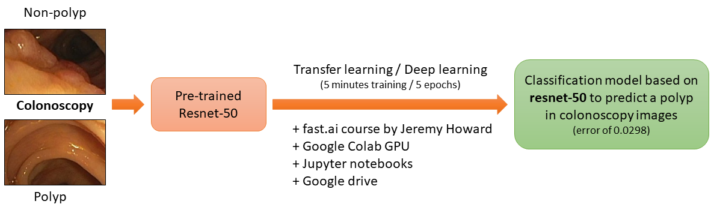

# Fastai-Colon-Polyps
Classification of polyps in colonoscopy images using Fastai deep learning

In 2018, I published a github repository **CNN4Polyps** about colonoscopy polyps detection (classification + localization into an image) with CNNs (https://github.com/muntisa/Colonoscopy-polyps-detection-with-CNNs) using *Keras*. I demonstrated that simple CNNs or *VGG16* transfer learning could be used in only few minutes (on a GPU) to create good classifiers able to detect a polyp in colonoscopy images.

Reading twitts these days, I found a great presentation of **Jeremy Howard** about "Future of Individualized Medicine 2019" (https://twitter.com/jeremyphoward/status/1112810731773190144). During the presentation, I was suprized to find that on **Modelzoo** there is no shared pre-trained network even if there are a lot of public medical imaging dataset and easy tools for DL such as *Fastai* & *Colab*. Therefore, I decide to spend one hour to adapt the *Fast.ai* Lesson 1 notebook (https://course.fast.ai/videos/?lesson=1) for my dataset. To be faster, I used Google Colab (https://colab.research.google.com) with GPU support.

 

The current dataset was generated with the previous project *CNN4Polyps* starting from a public datase: **910** images for training and **302** images for validation. All the models are saved in the project root, so you can easy load them and test your data.

The current script demonstrated the ability to create a very accurate classifier for medical imaging with an **accuracy of 0.99** using **resnet50** transfer learning fine tuning. Due to the github file dimension limitation, there are open links to the saved networks in my public gdrive.

## How to use

1. Predict colon polyps in one image from test folder: [Fastai-Colon-Polyps_Predict.ipynb](Fastai-Colon-Polyps_Predict.ipynb).
2. Re-train your better model using the current dataset: [Fastai-Colon-Polyps.ipynb](Fastai-Colon-Polyps.ipynb).

Hf with DL!
@muntisa
